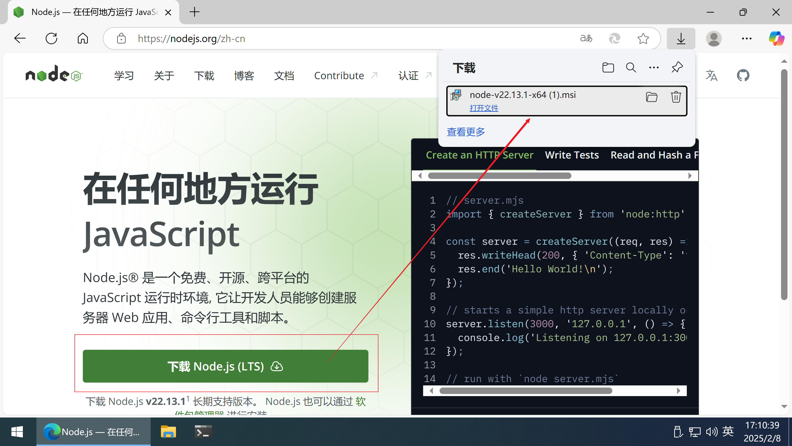
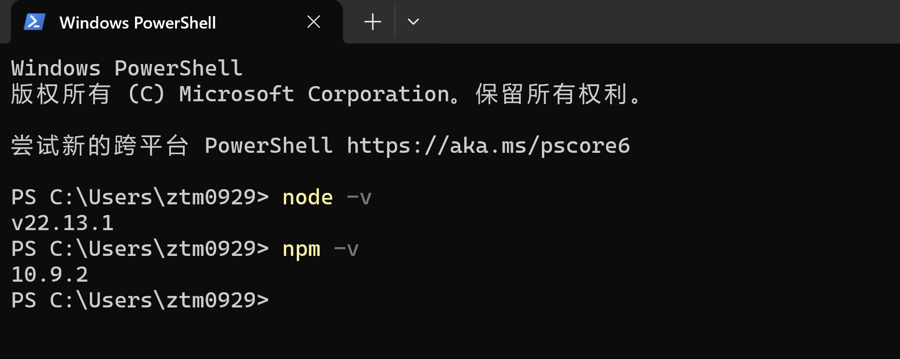
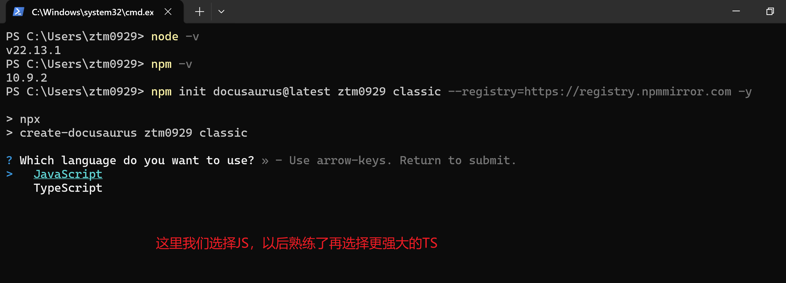
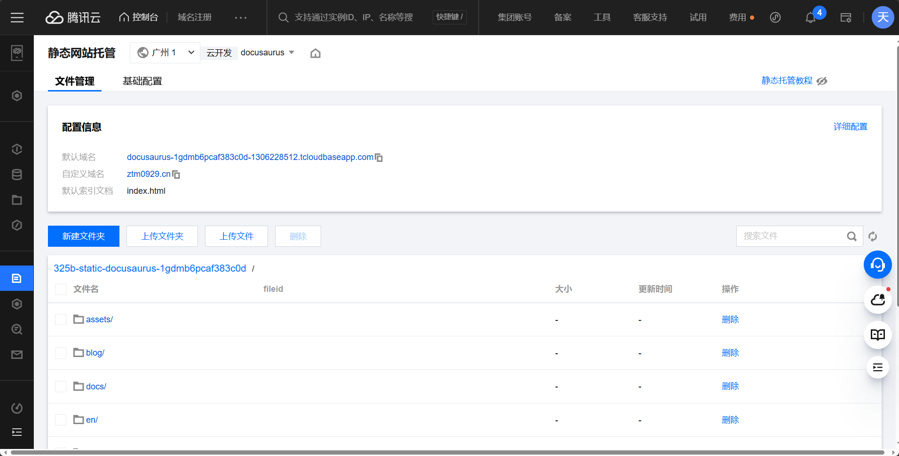
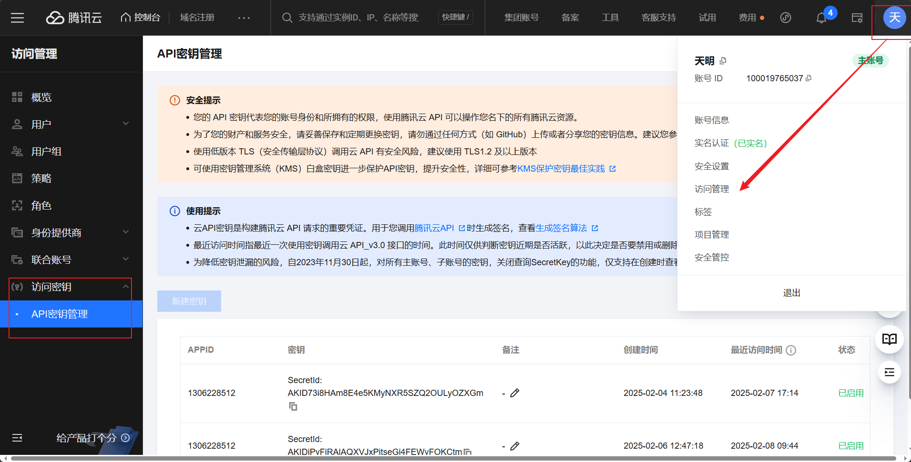
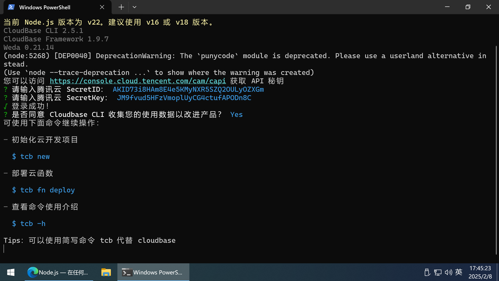
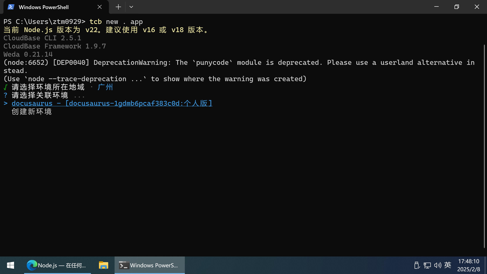

[**Docusaurus**](https://docusaurus.io/zh-CN/)（暂时没有中文名，我习惯叫作『小恐龙』😜）是 Facebook 团队开源的建站工具，这里记录一些我们在部署自己的文档站点时会用到的一些命令与解释。

<!-- truncate -->

## 安装 Node

1. 直接进入[官网](https://nodejs.org/zh-cn/)下载，在安装时保持默认选项即可。


1. 安装完成后，在 PowerShell 中分别输入 `node -v` 和 `npm -v` 来检查是否成功安装。



```powershell
node -v
# 返回版本号即表示安装成功
# v22.13.1

npm -v
# 返回版本号即表示安装成功
# 11.0.0
```

## 安装小恐龙

接着在命令行中输入这一行命令：



```powershell
npm init docusaurus@latest ztm0929 classic --registry=https://registry.npmmirror.com -y
```

各部分详细解释：

- `npm init docusaurus@latest`：使用 `npm` 去查找当前电脑里有没有小恐龙的最新版，如果没有小恐龙或不是最新的，就安装最新版然后进行项目初始化。
- `ztm0929`： 项目初始化的时候会创建一个根目录，当前目录的名字就是 `ztm0929`，可以任意替换成自己容易辨识的名字。
- `classic`：这里是固定参数，告诉小恐龙我们需要使用经典模板主题，[**目前只有这一个模板**](https://docusaurus.io/zh-CN/docs/api/themes)；（当然在安装完模板后依然可以进行自定义美化~）
- `--registry=https://registry.npmmirror.com`：表示 `npm` 在安装小恐龙时应该去哪个源仓库里查找，这里选择的是[淘宝开发团队](https://developer.aliyun.com/mirror/NPM)维护的仓库；
- `-y`：表示接受所有默认配置并跳过所有提示。

## 运行小恐龙

在完成安装后，输入 `npm run start`，就可以看到站点的页面啦！不过它只是临时运行的命令，我们最好先运行 `npm run build` 来构建完成的静态文件（其中生成的 `HTML/CSS/JavaScript` 文件就是网站的主体）

```powershell
# 构建静态文件，会在当前目录下生成一个名为 build 的文件夹存放静态文件
npm run build

# 基于静态文件的内容生成网站
npm run start
```

## 腾讯云配置

以上构建出来的站点目前只能通过 `http://localhost:3000` 访问，如果我们想要让朋友们也能够看到并且长期托管的话，最好还是找一家云服务商。
这里我选择的是**腾讯云**，可以按需自选其他的厂商，如阿里云、亚马逊云等等。

这里略过具体的注册步骤，直接进入控制台，访问[静态网站托管](https://cloud.tencent.com/document/product/876/40270)这个产品，我们需要将 `build` 文件夹里的内容上传进来，但是手动上传过于繁琐，因此我们需要另一个工具。




## 获取 API 密钥

API 密钥是我们稍后从本地与腾讯云交互的重要凭证，保存在记事本里，**不要外传！**否则可能被别人利用。



具体来说，最终会有类似的两个东西`SecretId`、`SecretKey`:


## CloudBase CLI 工具安装

CloudBase CLI 是云开发（Tencent CloudBase，TCB）开源的命令行界面交互工具，用于帮助用户快速、方便的部署项目，管理云开发资源。

下面这行命令与刚刚的[安装小恐龙](#安装小恐龙)很类似，不过这里是 `install`，相比 `init` 少了初始化的操作，只是安装这个工具。

```powershell
npm install -g @cloudbase/cli --registry=https://registry.npmmirror.com

cloudbase -v
# 安装完成后可以检查版本号确认是否成功安装
# Tip: cloudbase 命令可以简写为 tcb 
# CloudBase CLI 2.5.1
# CloudBase Framework 1.9.7
# Weda 0.21.14
```

安装完成之后，我们还需要将它绑定到腾讯云账号，就像是日常的登录软件一样：



```powershell
tcb login --key
# 在稍后的交互中将 SecretId 和 SecretKey 分别粘贴进来
```

## CLI 工具实现上传

根据官方文档的介绍，我们需要先执行项目初始化才能够让工具正确识别到账户里开通的资源。



```powershell
tcb new . app
# 这行命令输入完成后需要你在终端里选择资源相关的信息
```

确保项目根目录（我这里是 `ztm0929`）下多出来一个`cloudbase.json`文件，接着我们就可以输入下面的命令来上传 `build` 文件夹了~

```powershell
tcb hosting list
# 可以先查看腾讯云里有的文件，不过这时应该是空白的

tcb hosting deploy ./build
# 这行命令会将我们 build 文件夹里的内容直接上传
```

## 另请参阅

- [Docusaurus 官方文档](https://docusaurus.io/zh-CN/docs)
- [TCB CLI 托管静态网站的官方文档](https://docs.cloudbase.net/cli-v1/hosting)

欢迎将本文分享给对网站搭建感兴趣的朋友们，如有任何问题随时可以通过微信或邮件联系天明~

- 微信：ztm00929
- 邮件：[ztm0929@icloud.com](mailto:ztm0929@icloud.com)
